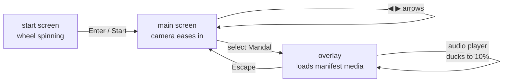

# chaitanyamalhotra.com

[](https://chaitanyamalhotra.com)
[](https://developer.mozilla.org/en-US/docs/Glossary/HTML5)
[](https://developer.mozilla.org/en-US/docs/Web/JavaScript)
[](https://threejs.org/)
[](https://tailwindcss.com/)
[](https://pages.github.com/)

The personal website, portfolio, and project playground of **Chaitanya Malhotra** — a multi-page static site that doubles as a home for several self-contained web experiments. There is no build step, no framework, no bundler: just hand-written HTML, CSS, and vanilla JavaScript, with Three.js and Stockfish pulled in for the interactive pieces.

What started as a lunar-phase visualizer grew into an industrial-themed resume, a 3D Rigveda explorer, a Stockfish-powered chess board, and a Sudoku solver — all living behind a single custom domain.

> **Live:** [chaitanyamalhotra.com](https://chaitanyamalhotra.com) · **GitHub:** [bhoot1234567890](https://github.com/bhoot1234567890)

## ✨ Features

- **Industrial portfolio** (`index.html`) — a Tailwind-styled resume with a live dark/light toggle, a swappable accent color driven by CSS variables, focus-area cards (AI/ML, 3D Graphics, Embedded/IoT, Full-Stack), an experience log, skills bars, and a project grid.
- **3D Rigveda wheel** (`rigveda.html` + `src/main.js`) — a golden chariot wheel rendered with Three.js, DRACO/KTX2-compressed GLTF, an `EffectComposer` + `UnrealBloomPass` glow pipeline, animated star fields, and canvas-generated radial text sprites for all 10 Mandals.
- **Manifest-driven content** (`assets/mandalas/manifest.json`) — each Mandal exposes a podcast, a video, the original Sanskrit text as a PDF, flashcards, and a cover image. Add a file, edit the JSON, done — no code changes required.
- **Lunar phase visualizer** (`moon.html`) — a 3D moon that tracks the current phase, with a "Reset View" control.
- **Chess vs Stockfish** (`chess.html`) — Human-vs-Human, Human-vs-AI, and AI-vs-AI modes running the real Stockfish engine in a Web Worker, with selectable search depth (5 / 10 / 15 / 18 / 20) and a pawn-promotion modal.
- **Sudoku solver & generator** (`sudoku.html` + `sudoku generator.js`) — classic backtracking to generate and solve full 9×9 boards.
- **Resumable media** — the background audio player (`src/player.js`) ducks its volume per screen (100% / 20% / 10%) and saves playback position to `localStorage`.
- **Accessible controls** — keyboard navigation (Enter to advance, Escape to back out, arrows to rotate) and an ARIA live region that announces Mandal changes.

## 📦 Repository Layout

```
.
├── index.html                       # Industrial portfolio / resume
├── rigveda.html                     # 3D Rigveda wheel entry point
├── moon.html                        # Lunar phase 3D visualizer
├── chess.html                       # Chess board (Stockfish AI)
├── sudoku.html                      # Sudoku solver UI
├── src/
│   ├── main.js                      # Three.js Rigveda scene + state machine
│   ├── player.js / player.css       # Context-aware background audio player
├── sudoku generator.js              # Backtracking board generator/solver
├── stockfish.js                     # Stockfish engine (loaded as a Web Worker)
├── assets/
│   ├── mandalas/manifest.json       # Mandal → media mapping (the content source of truth)
│   ├── models/*.glb                 # DRACO/KTX2-compressed 3D models
│   ├── podcasts/ · videos/          # Mandal audio & video
│   ├── original_text/ · flashcards/ # Sanskrit PDFs + flashcard PDFs
│   ├── music/                       # Background audio
│   └── lroc_color_poles_2k.png      # Lunar texture
├── chaitanya_malhotra_resume.tex    # LaTeX source for the resume
├── CNAME                            # chaitanyamalhotra.com (GitHub Pages)
└── CLAUDE.md                        # Notes for AI coding assistants
```

## 🚀 Usage

Because every page is static, you can open most files directly — but the Rigveda page imports ES modules and fetches the manifest, so it needs to be served over HTTP. Any static server works.

```bash
# Option A — Python's built-in server (no install)
python3 -m http.server 8000

# Option B — Node, if you have it
npx serve
```

Then visit:

```text
http://localhost:8000/         # portfolio
http://localhost:8000/rigveda  # 3D Rigveda wheel
http://localhost:8000/moon     # lunar phases
http://localhost:8000/chess    # chess vs Stockfish
http://localhost:8000/sudoku   # Sudoku solver
```

## ⚙️ How It Works

### Rigveda 3D experience

The center of the site is a Three.js application that runs a small screen state machine — `start` → `main` → `overlay` — with the camera easing between fixed positions using a cubic LERP:

```javascript
// src/main.js — non-linear easing for camera transitions
const t = 1 - Math.pow(1 - rawT, 3);
```

A `cameraAnimating` flag blocks input during transitions, the wheel steps by `(2π) / spokeCount` per Mandal, and radial text sprites fade in (`textFadeProgress` 0→1) as the camera approaches. Selecting a Mandal opens an overlay that lazily loads its podcast, video, PDFs, and cover from `manifest.json`, while the audio player ducks to 10% volume and resumes from the saved `localStorage` offset.



### Chess engine

`chess.html` maintains an 8×8 board array and converts it to FEN before handing each position to Stockfish, which runs in a Web Worker spawned from `stockfish.js`. The UCI handshake (`uci` → `uciok` → `isready` → `readyok`) gates moves on `stockfishReady`, and `go depth N` controls strength. AI-vs-AI mode loops `getAiMove()` so the engine plays both sides; promotions auto-queen for the AI but pop a selection modal for the human.

## 🧱 Adding Mandal Content

The Rigveda page is entirely data-driven — no JavaScript edits are needed to publish new material.

1. Drop files into the matching `assets/` subfolder (`podcasts/`, `videos/`, `original_text/`, `flashcards/`, `mandalas/`).
2. Update `assets/mandalas/manifest.json` with the new paths under the Mandal number (`1`–`10`).
3. Push to `main` — GitHub Pages serves it on the next deploy.

## 🚢 Deployment

The site is published through **GitHub Pages** with a custom domain set via `CNAME`.

```bash
git push origin main
```

GitHub Pages rebuilds and serves the `main` branch at [chaitanyamalhotra.com](https://chaitanyamalhotra.com).

## 🤝 Contributing


## 📄 License

No `LICENSE` file is present in this repository, so the source is **all rights reserved** by the author. The bundled `stockfish.js` is governed by its own GPL-licensed terms; contact the author before reusing any of this code.
